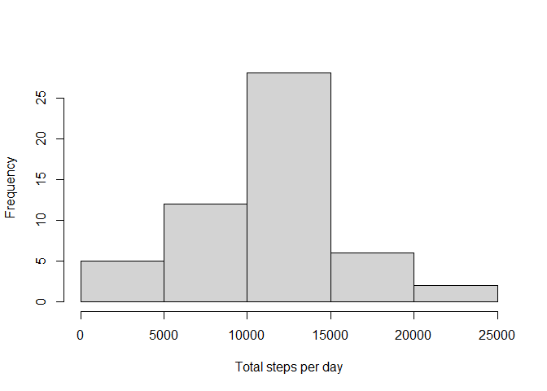

## Loading and preprocessing the data

1. Load the data (i.e. read.csv())


```r
data <- read.csv(unz("activity.zip", "activity.csv"), sep=",")
str(data)
```

```
## 'data.frame':	17568 obs. of  3 variables:
##  $ steps   : int  NA NA NA NA NA NA NA NA NA NA ...
##  $ date    : chr  "2012-10-01" "2012-10-01" "2012-10-01" "2012-10-01" ...
##  $ interval: int  0 5 10 15 20 25 30 35 40 45 ...
```

2. Process/transform the data (if necessary) into a format suitable for your analysis

## What is mean total number of steps taken per day?
For this part of the assignment, you can ignore the missing values in the dataset.

### 1. Calculate the total number of steps taken per day

```r
library(dplyr)
```

```
## Warning: replacing previous import 'vctrs::data_frame' by 'tibble::data_frame' when loading
## 'dplyr'
```

```
## 
## Attaching package: 'dplyr'
```

```
## The following objects are masked from 'package:stats':
## 
##     filter, lag
```

```
## The following objects are masked from 'package:base':
## 
##     intersect, setdiff, setequal, union
```

```r
TotalSteps <- data %>% 
      filter(!is.na(steps)) %>% 
      group_by(date) %>% 
      summarise(Total = sum(steps)) %>% 
      print(n=60)
```

```
## `summarise()` ungrouping output (override with `.groups` argument)
```

```
## # A tibble: 53 x 2
##    date       Total
##    <chr>      <int>
##  1 2012-10-02   126
##  2 2012-10-03 11352
##  3 2012-10-04 12116
##  4 2012-10-05 13294
##  5 2012-10-06 15420
##  6 2012-10-07 11015
##  7 2012-10-09 12811
##  8 2012-10-10  9900
##  9 2012-10-11 10304
## 10 2012-10-12 17382
## 11 2012-10-13 12426
## 12 2012-10-14 15098
## 13 2012-10-15 10139
## 14 2012-10-16 15084
## 15 2012-10-17 13452
## 16 2012-10-18 10056
## 17 2012-10-19 11829
## 18 2012-10-20 10395
## 19 2012-10-21  8821
## 20 2012-10-22 13460
## 21 2012-10-23  8918
## 22 2012-10-24  8355
## 23 2012-10-25  2492
## 24 2012-10-26  6778
## 25 2012-10-27 10119
## 26 2012-10-28 11458
## 27 2012-10-29  5018
## 28 2012-10-30  9819
## 29 2012-10-31 15414
## 30 2012-11-02 10600
## 31 2012-11-03 10571
## 32 2012-11-05 10439
## 33 2012-11-06  8334
## 34 2012-11-07 12883
## 35 2012-11-08  3219
## 36 2012-11-11 12608
## 37 2012-11-12 10765
## 38 2012-11-13  7336
## 39 2012-11-15    41
## 40 2012-11-16  5441
## 41 2012-11-17 14339
## 42 2012-11-18 15110
## 43 2012-11-19  8841
## 44 2012-11-20  4472
## 45 2012-11-21 12787
## 46 2012-11-22 20427
## 47 2012-11-23 21194
## 48 2012-11-24 14478
## 49 2012-11-25 11834
## 50 2012-11-26 11162
## 51 2012-11-27 13646
## 52 2012-11-28 10183
## 53 2012-11-29  7047
```

### 2. Make a histogram of the total number of steps taken each day

```r
hist(TotalSteps$Total, main = "", xlab = "Total steps per day")
```

<!-- -->

### 3. Calculate and report the mean and median of the total number of steps taken per day

```r
mean(TotalSteps$Total)
```

```
## [1] 10766.19
```

```r
median(TotalSteps$Total)
```

```
## [1] 10765
```

## What is the average daily activity pattern?

### 1. Make a time series plot (i.e. type = "l") of the 5-minute interval (x-axis) and the average number of steps taken, averaged across all days (y-axis)

```r
StepsInterval <- data %>% 
      filter(!is.na(steps)) %>% 
      group_by(interval) %>% 
      summarise(Mean = mean(steps))
```

```
## `summarise()` ungrouping output (override with `.groups` argument)
```

```r
plot(StepsInterval$interval, StepsInterval$Mean, type = "l", xlab = "5-min interval", ylab = "average steps")
```

<!-- -->

### 2. Which 5-minute interval, on average across all the days in the dataset, contains the maximum number of steps?

```r
StepsInterval %>% filter(Mean > 200)
```

```
## # A tibble: 1 x 2
##   interval  Mean
##      <int> <dbl>
## 1      835  206.
```
Answer: interval 835

## Imputing missing values
Note that there are a number of days/intervals where there are missing values (coded as NA). The presence of missing days may introduce bias into some calculations or summaries of the data.

### 1. Calculate and report the total number of missing values in the dataset (i.e. the total number of rows with NAs)

```r
na_count <- apply(data, 1, function(x) sum(is.na(x)))
sum(na_count)
```

```
## [1] 2304
```

### 2. Devise a strategy for filling in all of the missing values in the dataset. The strategy does not need to be sophisticated. For example, you could use the mean/median for that day, or the mean for that 5-minute interval, etc.
I will replace the NAs in steps with the median number of steps taken in that 5-minute interval

### 3. Create a new dataset that is equal to the original dataset but with the missing data filled in.

```r
Median <- data %>% 
      filter(!is.na(steps)) %>% 
      group_by(interval) %>% 
      summarise(Median = median(steps))
```

```
## `summarise()` ungrouping output (override with `.groups` argument)
```

```r
data_imputed <- merge(data, Median)
data_imputed$steps <- ifelse(is.na(data_imputed$steps), data_imputed$Median, data_imputed$steps)
data_imputed <- data_imputed[-c(4,5)]
str(data_imputed)
```

```
## 'data.frame':	17568 obs. of  3 variables:
##  $ interval: int  0 0 0 0 0 0 0 0 0 0 ...
##  $ steps   : int  0 0 0 0 0 0 0 0 0 0 ...
##  $ date    : chr  "2012-10-01" "2012-11-23" "2012-10-28" "2012-11-06" ...
```
### 4. Make a histogram of the total number of steps taken each day and Calculate and report the mean and median total number of steps taken per day. Do these values differ from the estimates from the first part of the assignment? What is the impact of imputing missing data on the estimates of the total daily number of steps?


```r
TotalSteps <- data_imputed %>% 
      group_by(date) %>% 
      summarise(Total = sum(steps))
```

```
## `summarise()` ungrouping output (override with `.groups` argument)
```

```r
hist(TotalSteps$Total, main = "", xlab = "Total steps per day")
```

<!-- -->

```r
mean(TotalSteps$Total)
```

```
## [1] 9503.869
```

```r
median(TotalSteps$Total)
```

```
## [1] 10395
```
Answer: Imputing missing data increases the frequency of a low number of steps taken, thereby decreases particularly the mean number of steps taken a day.

## Are there differences in activity patterns between weekdays and weekends?
For this part the weekdays() function may be of some help here. Use the dataset with the filled-in missing values for this part.

### 1. Create a new factor variable in the dataset with two levels – “weekday” and “weekend” indicating whether a given date is a weekday or weekend day.


```r
data_imputed <- data_imputed %>%
      mutate(date = as.Date(date, format = "%Y-%m-%d")) %>%
      mutate(weekd = weekdays(date, abbreviate = FALSE)) %>%
      mutate(weekd = ifelse((weekd == "zondag" | weekd == "zaterdag"), "weekend", "weekday"))
head(data_imputed)
```

```
##   interval steps       date   weekd
## 1        0     0 2012-10-01 weekday
## 2        0     0 2012-11-23 weekday
## 3        0     0 2012-10-28 weekend
## 4        0     0 2012-11-06 weekday
## 5        0     0 2012-11-24 weekend
## 6        0     0 2012-11-15 weekday
```

```r
str(data_imputed)
```

```
## 'data.frame':	17568 obs. of  4 variables:
##  $ interval: int  0 0 0 0 0 0 0 0 0 0 ...
##  $ steps   : int  0 0 0 0 0 0 0 0 0 0 ...
##  $ date    : Date, format: "2012-10-01" "2012-11-23" "2012-10-28" ...
##  $ weekd   : chr  "weekday" "weekday" "weekend" "weekday" ...
```

### 2. Make a panel plot containing a time series plot (i.e. type = "l") of the 5-minute interval (x-axis) and the average number of steps taken, averaged across all weekday days or weekend days (y-axis). See the README file in the GitHub repository to see an example of what this plot should look like using simulated data.


```r
library(ggplot2)
```

```
## Warning: package 'ggplot2' was built under R version 4.0.3
```

```r
StepsInterval <- data_imputed %>% 
      group_by(interval, weekd) %>% 
      summarise(Mean = mean(steps))
```

```
## `summarise()` regrouping output by 'interval' (override with `.groups` argument)
```

```r
ggplot(StepsInterval, mapping = aes(x = interval, y = Mean)) +
      geom_line(color = "blue") +
      facet_wrap(~weekd, ncol=1) +
      theme_classic() +
      theme(strip.background = element_rect(fill = "darkorange")) +
      ylab("Number of steps")
```

<!-- -->
